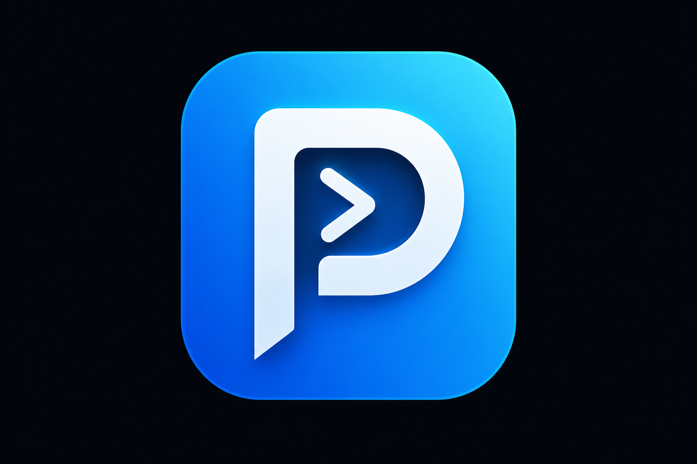

<div align="center">
  

  <p>
    
    
    
    
    
    
    
  </p>

  <p>
    Utilitário Windows com interface <strong>WebView2</strong>: scripts <strong>.bat</strong>,
    painel <strong>Winget</strong> e painel <strong>Debloat</strong>.
    <br />
    Python + pywebview + Winget — Windows 10 e 11.
  </p>
</div>

## Visão geral

O **Prompt Auxiliar** centraliza tarefas comuns de manutenção e personalização do Windows:

- **Scripts .bat** com confirmação, descrição e saída padronizada (uma tecla para fechar)
- **Painel Winget** — catálogo curado com busca, categorias e instalação em lote
- **Painel Debloat** — remoção de bloatware conhecido (Microsoft, Xbox, Bing legado Win10, OEM)
- **Ações sensíveis** — confirmação extra para registro, KMS, WinUtil e similares
- **Pasta de dados** em `C:\PromptAuxiliar` (softwares, registros, seleções dos painéis)

---

## Funcionalidades e como usar

### 1) Instalação rápida (one-liner)

Abra o **PowerShell** e execute:

```powershell
irm "https://raw.githubusercontent.com/luanwolf/PromptAuxiliar/main/win.ps1" | iex
```

**O que o instalador faz automaticamente**

| Etapa | O que acontece |
|-------|----------------|
| 1. Download | Baixa o repositório para `%LOCALAPPDATA%\PromptAuxiliar` (ou usa a pasta atual se você já clonou o projeto) |
| 2. Python | Procura **Python 3.10+** (`python` ou `py -3`). Se não existir, instala **Python 3.12** via `winget` |
| 3. Dependências | Executa `pip install -r requirements.txt` |
| 4. Pasta de dados | Prepara `C:\PromptAuxiliar` (softwares, registros, seleções) |
| 5. Atalhos | Cria atalhos na Área de Trabalho e Menu Iniciar (com ícone do app) |
| 6. Abrir app | Inicia a interface WebView2 |

**Variáveis opcionais** (antes do comando `irm`):

```powershell
$env:PROMPTAUX_HOME = "D:\Ferramentas\PromptAuxiliar"
$env:PROMPTAUX_UPDATE = "1"
irm "https://raw.githubusercontent.com/luanwolf/PromptAuxiliar/main/win.ps1" | iex
```

| Variável | Uso |
|----------|-----|
| `PROMPTAUX_HOME` | Pasta de instalação do app (padrão: `%LOCALAPPDATA%\PromptAuxiliar`) |
| `PROMPTAUX_UPDATE` | `1` força baixar de novo o ZIP do GitHub |
| `PROMPTAUX_BRANCH` | Branch do repositório (padrão: `main`) |

> Se o Python for instalado agora, o PATH pode exigir um **PowerShell novo** na próxima execução. O script tenta atualizar o PATH na mesma sessão antes de continuar.

---

### 2) Desenvolvimento local


| Passo        | Comando                           |
| ------------ | --------------------------------- |
| Dependências | `pip install -r requirements.txt` |
| Executar     | `python main.py`                  |


Requisitos: **Windows 10/11**, **Python 3.10+**, **WebView2 Runtime** (geralmente já presente no Windows 11).

---

### 3) Menu principal (scripts .bat)

Cada card executa um script em `scripts/`:


| Categoria      | Exemplos                                                                       |
| -------------- | ------------------------------------------------------------------------------ |
| **Instalação** | Atualizar via Winget, instalar da pasta `softwares`, Visual C++ Runtimes (AIO) |
| **Limpeza**    | Temporários, disco, MRT, limpeza profunda (SFC/DISM)                           |
| **Otimização** | Aplicar `.reg`, WinUtil (Chris Titus — PowerShell admin)                       |
| **Sistema**    | Rede, atalhos GodMode/BIOS, menu de contexto, inicialização, ativação (aviso)  |


**Fluxo de cada script**

1. Banner com título e descrição
2. Confirmação **S/N** (ações de risco pedem aviso extra)
3. Execução com passos numerados
4. **Pressione qualquer tecla para sair** (sem duplo Enter)

Scripts de **alto risco** (WinUtil, KMS) abrem **PowerShell como administrador** após você confirmar no pop-up do app.

---

### 4) Painel Winget


| Ação           | Como fazer                                                     |
| -------------- | -------------------------------------------------------------- |
| Abrir          | Barra lateral → **Painel Winget**                              |
| Buscar         | Campo de busca no topo (filtra por nome/descrição)             |
| Selecionar     | Clique nos itens ou use *Marcar categoria*                     |
| Instalar       | **Executar selecionados** — abre terminal com `winget install` |
| Salvar seleção | **Salvar seleção** grava em `C:\PromptAuxiliar\panels.json`    |


O catálogo inclui navegadores, dev tools, utilitários, jogos, personalização e **Runtimes** (ex.: Visual C++ AIO `abbodi1406.vcredist`).

---

### 5) Painel Debloat


| Ação         | Como fazer                                                                         |
| ------------ | ---------------------------------------------------------------------------------- |
| Abrir        | Barra lateral → **Painel Debloat**                                                 |
| Itens padrão | Na primeira execução, apps marcados como `padrao` vêm pré-selecionados             |
| Remover      | **Executar selecionados** — `winget uninstall` no terminal                         |
| Categorias   | Microsoft, Xbox, mídia, comunicação, **Bing legado (Win10)**, OEM, *Revisar antes* |


> Alguns pacotes **não existem** em todo PC (OEM, versão do Windows). Erros no terminal para IDs ausentes são normais.

Itens em **Revisar antes de remover** (OneDrive, Edge, Store) vêm **desmarcados** por padrão.

---

### 6) Barra lateral e links


| Controle              | Descrição                                                   |
| --------------------- | ----------------------------------------------------------- |
| **Pasta de dados**    | Abre `C:\PromptAuxiliar`                                    |
| **GitHub · luanwolf** | Repositório e perfil                                        |
| **Categorias**        | Filtra scripts por Instalação, Limpeza, Otimização, Sistema |
| **Todas**             | Lista completa de scripts                                   |


Para sair de um painel Winget/Debloat, use outro item da barra lateral ou **Esc**.

---

### 7) Ações com nível de risco


| Nível          | Comportamento                                      |
| -------------- | -------------------------------------------------- |
| **Normal**     | Executa após um clique                             |
| **Atenção**    | Modal de confirmação no app                        |
| **Alto risco** | Modal + aviso; KMS/WinUtil em PowerShell **admin** |


---

## Pasta de dados

```text
C:\PromptAuxiliar\
├── panels.json       # seleção Winget / Debloat
├── softwares\        # .exe, .msi, .lnk para instalar_software.bat
└── registros\        # arquivos .reg para aplicar_ajustes.bat
```

---

## Estrutura do projeto

```text
app/
  actions.py          # catálogo de ações (.bat)
  api.py              # bridge WebView ↔ Python
  panels.py           # Winget / Debloat
  runner.py           # execução de scripts e PS admin
  data/
    winget_catalog.json
    debloat_catalog.json
scripts/              # .bat + _ui.bat (interface comum)
web/                  # interface HTML/CSS/JS
main.py               # entrada
win.ps1               # instalador one-liner
```

---

## Personalizar catálogos

Edite `app/data/winget_catalog.json` ou `app/data/debloat_catalog.json` (campos: `id`, `nome`, `categoria`, `descricao`; Debloat aceita `padrao: true`).

IDs devem ser válidos para:

```powershell
winget install --id <ID> -h
winget uninstall --id <ID> -h
```

---

## Créditos e licença

Desenvolvido por **[luanwolf](https://github.com/luanwolf)**.

Inspirado em fluxos de utilitários Windows (WinUtil, listas de debloat da comunidade). Use por sua conta e risco em ações de sistema, registro e ativação.